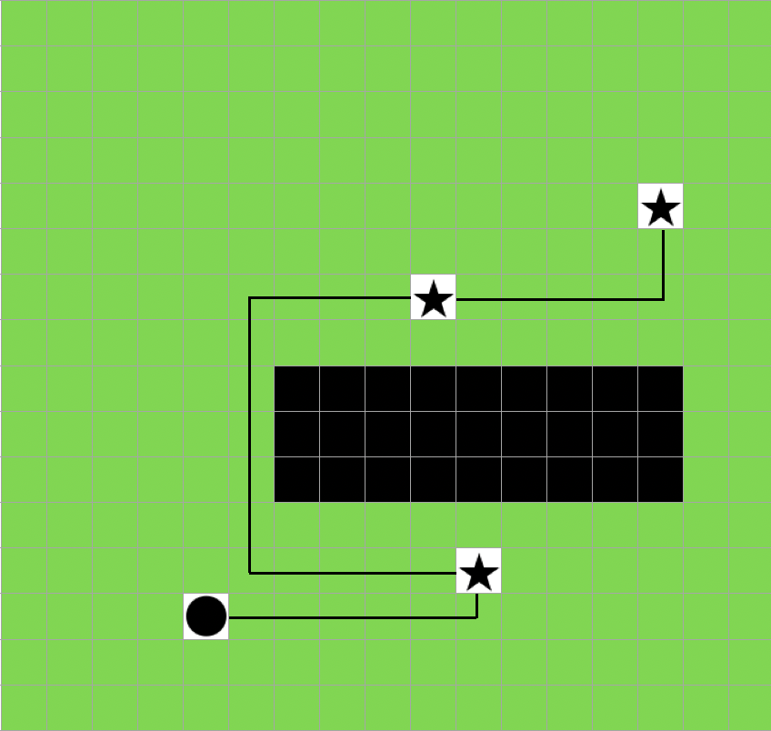
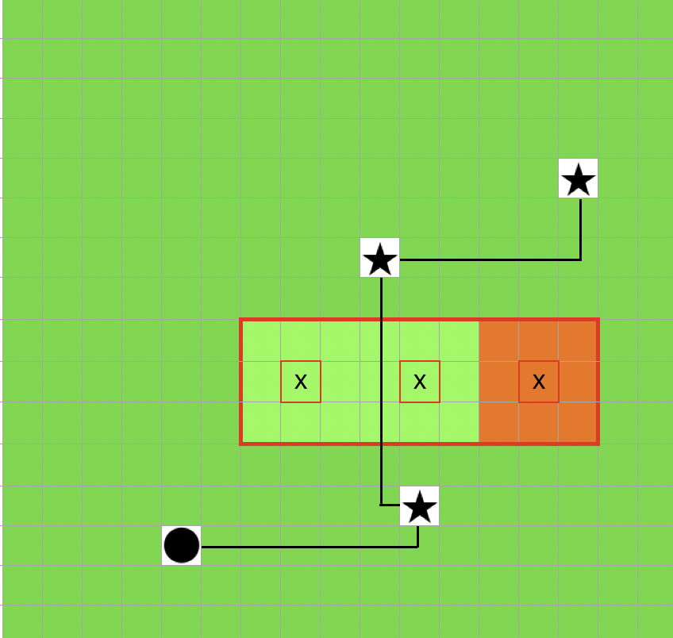

# Best Path

A Rust tool designed to facilitate robot navigation within a world by computing the shortest path based on known nodes and nodes of interest.

## Features

- Compute the shortest path for a robot within a specified world.
- Discover new nodes during pathfinding (optional). 
- Navigate the robot based on computed paths.

## Demonstration
Image 1 with discover false. There's a hole in the map. Returns the path to the targets


Image 2 with discover true. With 3 discover we can predict the tile type in the hole. The path may not work.


## Installation

Add this to your `Cargo.toml`:

```toml
[dependencies]
holy_crab_best_path = { version = "0.1.3", registry = "kellnr" }
```

## Usage

Here's a simple example demonstrating how to use the library to compute the shortest path for a robot:

```rust
use std::collections::HashMap;
use robotics_lib::energy::Energy;
use robotics_lib::event::events::Event;
use robotics_lib::interface::Tools;
use robotics_lib::runner::backpack::BackPack;
use robotics_lib::runner::{Robot, Runnable, Runner};
use robotics_lib::world::coordinates::Coordinate;
use robotics_lib::world::environmental_conditions::EnvironmentalConditions;
use robotics_lib::world::environmental_conditions::WeatherType::{Rainy, Sunny};
use robotics_lib::world::tile::TileType::Grass;
use robotics_lib::world::tile::{Content, Tile};
use robotics_lib::world::world_generator::Generator;
use robotics_lib::world::World;
use holy_crab_best_path::BestPath;

fn main() {
    struct MyRobot(Robot);
    struct WorldGenerator {
        size: usize,
    }
    impl WorldGenerator {
        fn init(size: usize) -> Self {
            WorldGenerator { size }
        }
    }
    impl Generator for WorldGenerator {
        fn gen(
            &mut self,
        ) -> (
            Vec<Vec<Tile>>,
            (usize, usize),
            EnvironmentalConditions,
            f32,
            Option<HashMap<Content, f32>>,
        ) {
            let mut map: Vec<Vec<Tile>> = Vec::new();
            // Initialize the map with default tiles
            for _ in 0..self.size {
                let mut row: Vec<Tile> = Vec::new();
                for _ in 0..self.size {
                    let tile_type = Grass;
                    let content = Content::None;
                    row.push(Tile {
                        tile_type,
                        content,
                        elevation: 0,
                    });
                }
                map.push(row);
            }
            let environmental_conditions = EnvironmentalConditions::new(&[Sunny, Rainy], 15, 12).unwrap();

            let max_score = rand::random::<f32>();

            (map, (0, 0), environmental_conditions, max_score, None)
        }
    }
    impl Runnable for MyRobot {
        fn process_tick(&mut self, world: &mut World) {
            /// Real test
            /// Real test
            let nodi_conosciuti: Vec<((i32, i32), Tile)> = vec![];
            let nodi_interesse: Vec<(i32, i32)> = vec![(1,3), (3,3), (3,1)];
            println!("{:?}", BestPath::shortest_path(self, world, &nodi_conosciuti, nodi_interesse, (0,0), true ));
            // prints: [[Right, Right, Right, Down], [Down, Down], [Left, Left]]    
        }

        fn handle_event(&mut self, event: Event) {
            println!();
            println!("{:?}", event);
            println!();
        }

        fn get_energy(&self) -> &Energy {
            &self.0.energy
        }
        fn get_energy_mut(&mut self) -> &mut Energy {
            &mut self.0.energy
        }

        fn get_coordinate(&self) -> &Coordinate {
            &self.0.coordinate
        }
        fn get_coordinate_mut(&mut self) -> &mut Coordinate {
            &mut self.0.coordinate
        }

        fn get_backpack(&self) -> &BackPack {
            &self.0.backpack
        }
        fn get_backpack_mut(&mut self) -> &mut BackPack {
            &mut self.0.backpack
        }
    }

    let r = MyRobot(Robot::new());
    struct Tool;
    impl Tools for Tool {}
    let mut generator = WorldGenerator::init(100);
    let run = Runner::new(Box::new(r), &mut generator);

    //Known bug: 'check_world' inside 'Runner::new()' fails every time
    match run {
        | Ok(mut r) => {
            let _ = r.game_tick();
        }
        | Err(e) => println!("{:?}", e),
    }
}
```

## Documentation

For detailed documentation on each function and its usage, refer to the Rust documentation generated by running:

```bash
cargo doc --open
```
